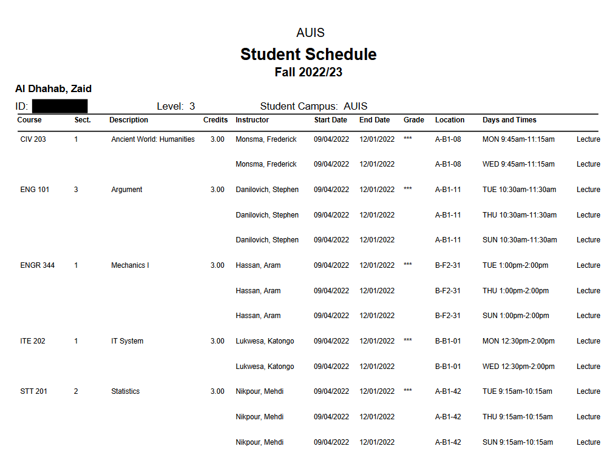
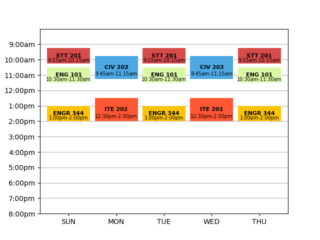

# More Readable Schedule
---
Helps make the AUIS schedule more readable and efficient. 
Using the pdfplumber libirary, it reads american style course codes along with their dates and times to create a better looking table and schedule.


# ℹ️ Overview
---
This programs story starts in 2020 when i started university and was given my university schedule as a pdf. My first thought at looking at the schedule was "wow this is ugly", so using my new found python skills i vowed to fix it.

# 🚀 Usage
---
Using pdfplumber turn the pdf into addressable text.
```python
    with pdfplumber.open("sche.pdf") as pdf:   #open the schedule pdf and extract its text
        page = pdf.pages[0]
        text = page.extract_text()

```

And uses google calander api to set up events from the pdf
```python 
    event = service.events().insert(calendarId='primary', body=event).execute()
    print('Event created: %s' % (event.get('htmlLink')))
```
takes schedule from this 

to this 



# ⬇️ Installation and running
---
you will need to create your own credentials from the google api https://developers.google.com/workspace/guides/create-credentials and add the credentials.json file to the directory.

run 
```
git clone https://github.com/thewackyworld/AUIS-schedule-creator-reader.git
```
then activate the virtual environment
```
myenv\Scripts\activate
```
once inside the environment you run the script with the your pdf's name passed as an arguemnt (it is recomended to put the pdf file in the programs directory)
```
python -u main.py <YOUR_PDF>
```